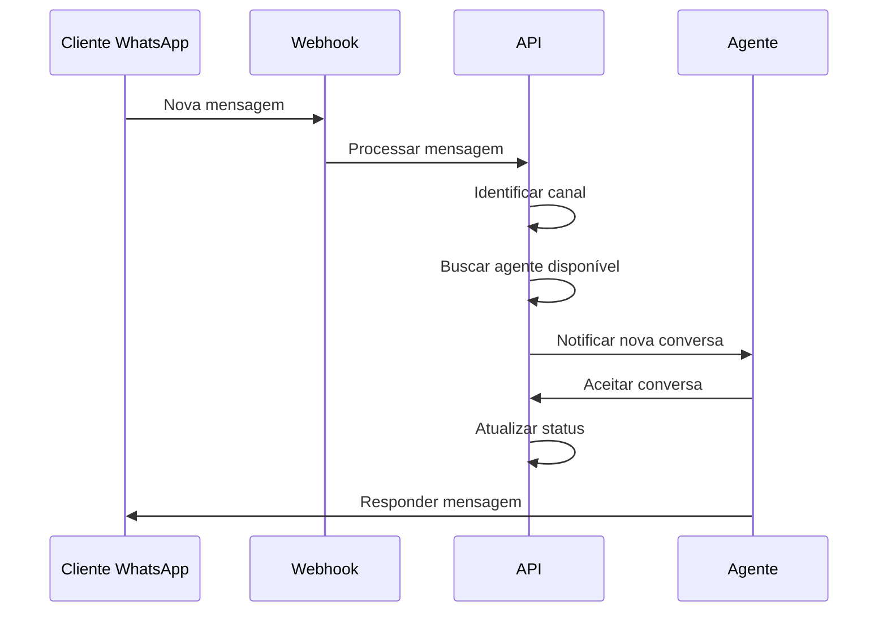

# Gestão de Atendentes

## Visão Geral

O sistema permite gerenciar atendentes que irão interagir com os clientes via WhatsApp. Cada atendente pode ser associado a um ou mais canais e ter diferentes níveis de permissão.

## Papéis e Permissões

| Papel | Descrição | Permissões |
|-------|-----------|------------|
| ADMIN | Administrador do sistema | Todas as permissões |
| MANAGER | Gerente de atendimento | Gerenciar atendentes, visualizar relatórios |
| AGENT | Atendente | Enviar/receber mensagens, gerenciar conversas |

## Endpoints

### Criar Atendente

<div class="endpoint-container">
  <div class="endpoint-header">
    <span class="method-badge method-post">POST</span>
    <span class="api-url">/companies/{companyId}/agents</span>
  </div>
  <div class="endpoint-body">
    
```json
{
  "name": "João Silva",
  "email": "joao@empresa.com",
  "role": "AGENT",
  "channels": [1, 2],
  "settings": {
    "maxSimultaneousChats": 5,
    "autoReply": true,
    "signature": "Atenciosamente, João"
  }
}
```

  </div>
</div>

### Atualizar Atendente

<div class="endpoint-container">
  <div class="endpoint-header">
    <span class="method-badge method-put">PUT</span>
    <span class="api-url">/companies/{companyId}/agents/{agentId}</span>
  </div>
  <div class="endpoint-body">
    
```json
{
  "name": "João Silva",
  "role": "MANAGER",
  "active": true,
  "settings": {
    "maxSimultaneousChats": 10
  }
}
```

  </div>
</div>

### Listar Atendentes

<div class="endpoint-container">
  <div class="endpoint-header">
    <span class="method-badge method-get">GET</span>
    <span class="api-url">/companies/{companyId}/agents</span>
  </div>
  <div class="endpoint-body">
    
Parâmetros de Query:
- `page`: Número da página
- `limit`: Itens por página
- `status`: Status do atendente (ONLINE, OFFLINE, BUSY)
- `channelId`: Filtrar por canal

  </div>
</div>

## Estrutura de Dados

### Agent

```typescript
interface Agent {
  id: number;
  companyId: number;
  name: string;
  email: string;
  role: 'ADMIN' | 'MANAGER' | 'AGENT';
  status: 'ONLINE' | 'OFFLINE' | 'BUSY';
  channels: Channel[];
  settings: AgentSettings;
  createdAt: Date;
  updatedAt: Date;
}

interface AgentSettings {
  maxSimultaneousChats: number;
  autoReply: boolean;
  autoReplyMessage?: string;
  signature?: string;
  workingHours: {
    start: string;
    end: string;
    days: number[];
  };
}
```

## Fluxo de Trabalho



## Gestão de Disponibilidade

### Status do Atendente

- **ONLINE**: Disponível para novas conversas
- **OFFLINE**: Indisponível
- **BUSY**: Ocupado com o máximo de conversas

### Atualizar Status

<div class="endpoint-container">
  <div class="endpoint-header">
    <span class="method-badge method-put">PUT</span>
    <span class="api-url">/companies/{companyId}/agents/{agentId}/status</span>
  </div>
  <div class="endpoint-body">
    
```json
{
  "status": "ONLINE",
  "reason": "Retorno do almoço"
}
```

  </div>
</div>

## Distribuição de Conversas

O sistema distribui as conversas automaticamente seguindo estas regras:

1. Prioriza agentes com menos conversas ativas
2. Respeita o limite máximo de conversas simultâneas
3. Considera o horário de trabalho do agente
4. Mantém histórico de interações anteriores

### Configurar Distribuição

<div class="endpoint-container">
  <div class="endpoint-header">
    <span class="method-badge method-put">PUT</span>
    <span class="api-url">/companies/{companyId}/channels/{channelId}/distribution</span>
  </div>
  <div class="endpoint-body">
    
```json
{
  "type": "ROUND_ROBIN",
  "settings": {
    "maxQueueSize": 10,
    "maxWaitTime": 300,
    "fallbackAgentId": 1
  }
}
```

  </div>
</div>

## Métricas e Relatórios

### Métricas do Atendente

<div class="endpoint-container">
  <div class="endpoint-header">
    <span class="method-badge method-get">GET</span>
    <span class="api-url">/companies/{companyId}/agents/{agentId}/metrics</span>
  </div>
  <div class="endpoint-body">
    
Retorna:
- Total de conversas
- Tempo médio de resposta
- Taxa de resolução
- Avaliações dos clientes

  </div>
</div>

## Próximos Passos

- [Tipos de Mensagens](./message-types.md)
- [Gestão de Conversas](./conversation-management.md)
- [Relatórios](./reports.md) 