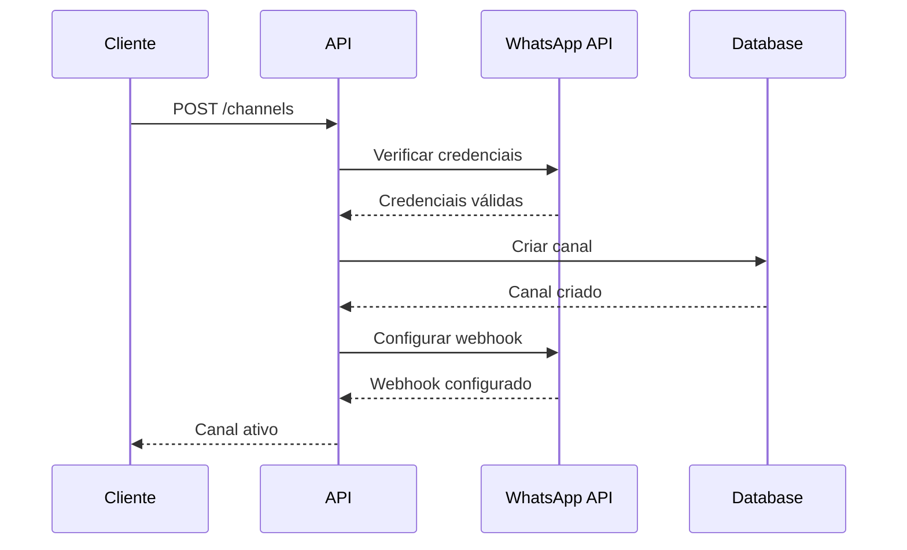

# Configuração de Canais

## Visão Geral

Os canais são os números de WhatsApp que sua empresa utiliza para comunicação. Cada empresa pode ter múltiplos canais, e cada canal precisa ser configurado corretamente no WhatsApp Business API.

## Pré-requisitos

- Conta WABA configurada
- Número de telefone verificado
- Credenciais do WhatsApp Business API

## Obtendo Dados do Canal

### 1. No Facebook Business Manager

1. Acesse [business.facebook.com](https://business.facebook.com)
2. Vá para "Configurações do Negócio" > "Contas do WhatsApp"
3. Selecione o número desejado
4. Anote:
   - Phone Number ID
   - WhatsApp Business Account ID
   - Display Phone Number

### 2. No Facebook Developers

1. Acesse [developers.facebook.com](https://developers.facebook.com)
2. Selecione seu aplicativo
3. Vá para "WhatsApp" > "Configuração"
4. Anote:
   - Permanent Auth Token
   - App Secret

## Endpoints

### Criar Canal

<div class="endpoint-container">
  <div class="endpoint-header">
    <span class="method-badge method-post">POST</span>
    <span class="api-url">/companies/{companyId}/channels</span>
  </div>
  <div class="endpoint-body">
    
```json
{
  "name": "Canal Principal",
  "type": "WHATSAPP_CLOUD",
  "phoneNumber": "5511999999999",
  "fbNumberPhoneId": "123456789",
  "fbBusinessAccountId": "987654321",
  "fbPermanentToken": "seu-token-permanente"
}
```

  </div>
</div>

### Atualizar Canal

<div class="endpoint-container">
  <div class="endpoint-header">
    <span class="method-badge method-put">PUT</span>
    <span class="api-url">/companies/{companyId}/channels/{channelId}</span>
  </div>
  <div class="endpoint-body">
    
```json
{
  "name": "Novo Nome",
  "active": true,
  "settings": {
    "autoReply": true,
    "autoReplyMessage": "Olá! Em breve retornaremos sua mensagem."
  }
}
```

  </div>
</div>

### Listar Canais

<div class="endpoint-container">
  <div class="endpoint-header">
    <span class="method-badge method-get">GET</span>
    <span class="api-url">/companies/{companyId}/channels</span>
  </div>
</div>

### Detalhes do Canal

<div class="endpoint-container">
  <div class="endpoint-header">
    <span class="method-badge method-get">GET</span>
    <span class="api-url">/companies/{companyId}/channels/{channelId}</span>
  </div>
</div>

## Estrutura de Dados

### Channel

```typescript
interface Channel {
  id: number;
  companyId: number;
  name: string;
  type: 'WHATSAPP_CLOUD';
  phoneNumber: string;
  fbNumberPhoneId: string;
  fbBusinessAccountId: string;
  active: boolean;
  settings: ChannelSettings;
  createdAt: Date;
  updatedAt: Date;
}

interface ChannelSettings {
  autoReply: boolean;
  autoReplyMessage?: string;
  businessHours: {
    start: string;
    end: string;
  };
  timezone: string;
}
```

## Fluxo de Criação



## Verificação do Canal

Após criar um canal, você pode testar enviando uma mensagem:

<div class="endpoint-container">
  <div class="endpoint-header">
    <span class="method-badge method-post">POST</span>
    <span class="api-url">/companies/{companyId}/channels/{channelId}/messages</span>
  </div>
  <div class="endpoint-body">
    
```json
{
  "to": "5511999999999",
  "type": "text",
  "text": {
    "body": "Teste de mensagem"
  }
}
```

  </div>
</div>

## Solução de Problemas

### Canal Não Envia Mensagens

1. Verifique se o token permanente é válido
2. Confirme se o número está verificado
3. Verifique os logs do webhook

### Erro de Autenticação

1. Atualize o token permanente
2. Verifique as permissões do aplicativo
3. Confirme o Phone Number ID

## Próximos Passos

- [Tipos de Mensagens](./message-types.md)
- [Gestão de Atendentes](./agent-management.md)
- [Webhooks](./webhooks.md) 