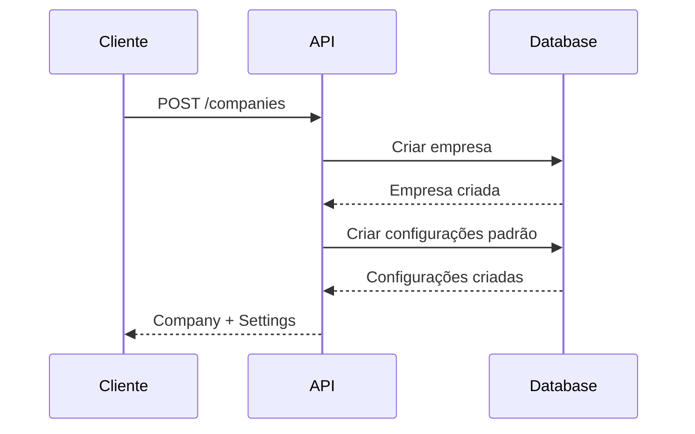

# Gestão de Empresas

## Visão Geral

O sistema suporta múltiplas empresas (multi-tenant), onde cada empresa pode ter:

- Múltiplos canais de WhatsApp
- Equipes de atendentes
- Configurações próprias de webhook
- Relatórios individualizados

## Endpoints

### Criar Empresa

<div class="endpoint-container">
  <div class="endpoint-header">
    <span class="method-badge method-post">POST</span>
    <span class="api-url">/companies</span>
  </div>
  <div class="endpoint-body">
    
```json
{
  "name": "Nome da Empresa",
  "document": "CNPJ",
  "email": "contato@empresa.com",
  "phone": "11999999999",
  "settings": {
    "timezone": "America/Sao_Paulo",
    "businessHours": {
      "start": "09:00",
      "end": "18:00"
    }
  }
}
```

  </div>
</div>

### Atualizar Empresa

<div class="endpoint-container">
  <div class="endpoint-header">
    <span class="method-badge method-put">PUT</span>
    <span class="api-url">/companies/{companyId}</span>
  </div>
  <div class="endpoint-body">
    
```json
{
  "name": "Novo Nome",
  "settings": {
    "timezone": "America/Sao_Paulo",
    "businessHours": {
      "start": "08:00",
      "end": "17:00"
    }
  }
}
```

  </div>
</div>

### Listar Empresas

<div class="endpoint-container">
  <div class="endpoint-header">
    <span class="method-badge method-get">GET</span>
    <span class="api-url">/companies</span>
  </div>
  <div class="endpoint-body">
    
Parâmetros de Query:
- `page`: Número da página
- `limit`: Itens por página
- `search`: Busca por nome ou documento

  </div>
</div>

### Detalhes da Empresa

<div class="endpoint-container">
  <div class="endpoint-header">
    <span class="method-badge method-get">GET</span>
    <span class="api-url">/companies/{companyId}</span>
  </div>
</div>

## Estrutura de Dados

### Company

```typescript
interface Company {
  id: number;
  name: string;
  document: string;
  email: string;
  phone: string;
  status: 'ACTIVE' | 'INACTIVE' | 'PENDING';
  settings: CompanySettings;
  createdAt: Date;
  updatedAt: Date;
}

interface CompanySettings {
  timezone: string;
  businessHours: {
    start: string;
    end: string;
  };
  autoReply: boolean;
  autoReplyMessage?: string;
}
```

## Fluxo de Criação



## Permissões

| Ação | Papel Necessário |
|------|-----------------|
| Criar | ADMIN |
| Atualizar | ADMIN |
| Listar | ADMIN |
| Ver Detalhes | ADMIN, MANAGER |

## Webhooks

### Eventos Disponíveis

- `company.created`
- `company.updated`
- `company.status_changed`

### Exemplo de Payload

```json
{
  "event": "company.created",
  "company": {
    "id": 1,
    "name": "Empresa Exemplo",
    "status": "ACTIVE"
  },
  "timestamp": "2024-01-01T10:00:00Z"
}
```

## Próximos Passos

- [Configuração de Canais](./channel-setup.md)
- [Gestão de Atendentes](./agent-management.md)
- [Relatórios](./reports.md) 