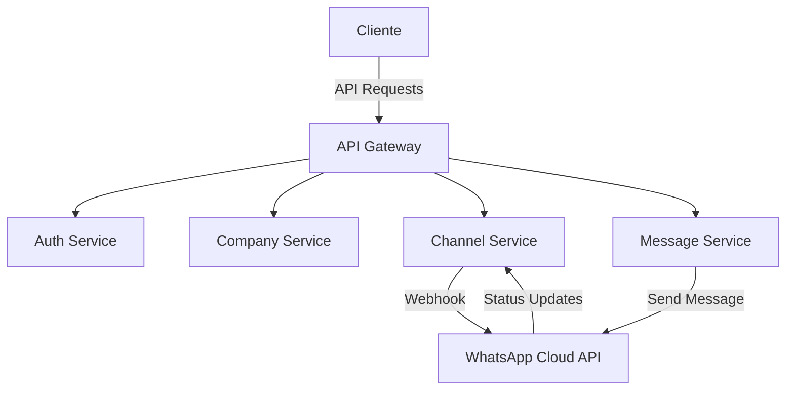

# WhatsApp Business API Integration

## Visão Geral

Esta API fornece uma integração completa com o WhatsApp Business API (WABA), permitindo que empresas gerenciem suas comunicações via WhatsApp de forma profissional e escalável. O sistema suporta múltiplas empresas (multi-tenant), múltiplos canais por empresa e gerenciamento completo de conversas e atendentes.

## Principais Funcionalidades

- 🏢 **Multi-tenant**: Suporte a múltiplas empresas na mesma instalação
- 📱 **Múltiplos Canais**: Cada empresa pode ter vários números de WhatsApp
- 👥 **Gestão de Atendentes**: Sistema completo de cadastro e gerenciamento de atendentes
- 💬 **Tipos de Mensagem**: Suporte a texto, imagem, documento, áudio e vídeo
- 📊 **Status de Entrega**: Rastreamento completo do status das mensagens
- 🔄 **Webhooks**: Sistema robusto de notificações em tempo real

## Arquitetura

## Fluxo de Integração

1. **Cadastro da Empresa**
   - Criação da conta empresarial
   - Configuração de dados básicos
   - Geração de credenciais de acesso

2. **Configuração do WABA**
   - Criação da conta no Facebook Business
   - Obtenção das credenciais do WhatsApp Business
   - Configuração do webhook por empresa

3. **Gestão de Canais**
   - Cadastro de números do WhatsApp
   - Vinculação com a conta WABA
   - Configuração de webhooks por canal

4. **Gestão de Atendentes**
   - Cadastro de usuários
   - Definição de permissões
   - Vinculação com canais

## Próximos Passos

- [Configuração da Conta WABA](./waba-setup.md)
- [Gestão de Empresas](./company-management.md)
- [Configuração de Canais](./channel-setup.md)
- [Gestão de Atendentes](./agent-management.md)
- [Tipos de Mensagens](./message-types.md) 