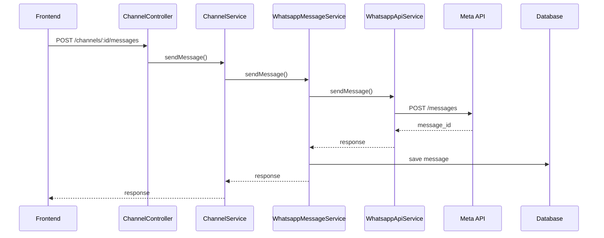
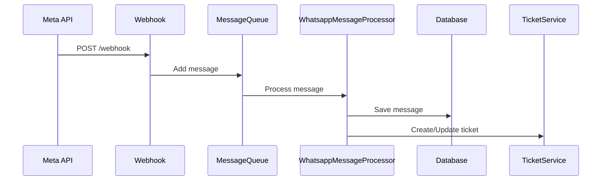
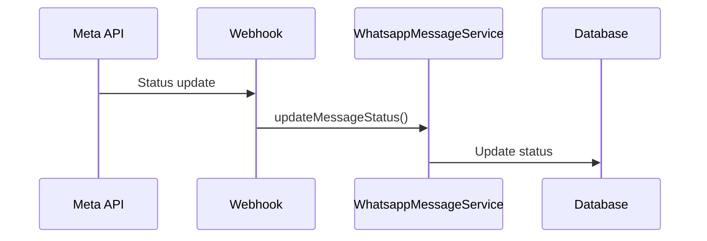

# Documentação do Sistema de Mensagens WhatsApp

## Índice
1. [Visão Geral](#visão-geral)
2. [Endpoints](#endpoints)
3. [Fluxo de Mensagens](#fluxo-de-mensagens)
4. [Tipos de Mensagem](#tipos-de-mensagem)
5. [Status das Mensagens](#status-das-mensagens)
6. [Tratamento de Erros](#tratamento-de-erros)
7. [Exemplos](#exemplos)

## Visão Geral

O sistema de mensagens do WhatsApp é composto por vários componentes que trabalham juntos para enviar, receber e gerenciar mensagens:

- **ChannelController**: Gerencia endpoints de envio
- **ChannelService**: Valida canais e coordena envios
- **WhatsappMessageService**: Processa e salva mensagens
- **WhatsappApiService**: Comunica com a API do Meta/WhatsApp

## Endpoints

### Envio de Mensagens
```http
POST /whatsapp/channels/:id/messages
```

**Parâmetros:**
- `id`: ID do canal (path)
- `companyId`: ID da empresa (query)
- `body`: Dados da mensagem (JSON)

**Exemplo de Corpo:**
```json
{
  "to": "5511999999999",
  "type": "text",
  "text": "Olá, como posso ajudar?"
}
```

### Consulta de Mensagens

```http
GET /whatsapp/messages/phone/:phone
GET /whatsapp/messages/channel/:channelId
GET /whatsapp/messages/ticket/:ticketId
GET /whatsapp/messages/:id
```

## Fluxo de Mensagens

### 1. Envio de Mensagem



### 2. Recebimento de Mensagem



### 3. Atualização de Status



## Tipos de Mensagem

### 1. Texto
```json
{
  "to": "5511999999999",
  "type": "text",
  "text": "Olá, como posso ajudar?"
}
```

### 2. Imagem
```json
{
  "to": "5511999999999",
  "type": "image",
  "mediaUrl": "https://example.com/image.jpg",
  "caption": "Foto do produto"
}
```

### 3. Documento
```json
{
  "to": "5511999999999",
  "type": "document",
  "mediaUrl": "https://example.com/doc.pdf",
  "filename": "contrato.pdf",
  "caption": "Contrato de serviço"
}
```

### 4. Áudio
```json
{
  "to": "5511999999999",
  "type": "audio",
  "mediaUrl": "https://example.com/audio.mp3"
}
```

### 5. Vídeo
```json
{
  "to": "5511999999999",
  "type": "video",
  "mediaUrl": "https://example.com/video.mp4",
  "caption": "Tutorial do produto"
}
```

## Status das Mensagens

1. **SENT**: Mensagem enviada para a API do WhatsApp
2. **DELIVERED**: Mensagem entregue ao destinatário
3. **READ**: Mensagem lida pelo destinatário
4. **FAILED**: Falha no envio da mensagem

## Tratamento de Erros

### 1. Validações
- Formato da mensagem (DTO)
- Status do canal
- Credenciais válidas
- Tipo de mídia correto

### 2. Erros Comuns
```typescript
// Canal não encontrado
throw new NotFoundException('Canal não encontrado');

// Canal desconectado
throw new NotFoundException('Canal não está conectado');

// Dados inválidos
throw new BadRequestException('Text is required for text messages');

// Erro da API do WhatsApp
throw new BadRequestException({
  code: apiError.code,
  message: apiError.message,
  details: apiError.error_data
});
```

## Exemplos

### 1. Envio de Mensagem de Texto
```typescript
// Requisição
const response = await api.post('/whatsapp/channels/1/messages', {
  to: "5511999999999",
  type: "text",
  text: "Olá, como posso ajudar?"
});

// Resposta
{
  "message": {
    "id": 123,
    "messageId": "wamid.xxx123",
    "status": "SENT",
    "type": "text",
    "content": "Olá, como posso ajudar?",
    "timestamp": "2024-03-20T10:30:00Z",
    "direction": "outbound"
  },
  "whatsapp": {
    "messages": [{
      "id": "wamid.xxx123"
    }]
  }
}
```

### 2. Consulta de Histórico
```typescript
// Requisição
const messages = await api.get('/whatsapp/messages/phone/5511999999999?companyId=1');

// Resposta
[
  {
    "id": 123,
    "messageId": "wamid.xxx123",
    "type": "text",
    "content": "Olá, como posso ajudar?",
    "timestamp": "2024-03-20T10:30:00Z",
    "status": "delivered",
    "direction": "outbound",
    "sender": {
      "id": 1,
      "name": "João",
      "type": "agent"
    }
  },
  {
    "id": 124,
    "messageId": "wamid.xxx124",
    "type": "text",
    "content": "Olá, preciso de ajuda com meu pedido",
    "timestamp": "2024-03-20T10:31:00Z",
    "status": "read",
    "direction": "inbound",
    "sender": {
      "id": null,
      "name": null,
      "type": "customer"
    }
  }
]
``` 